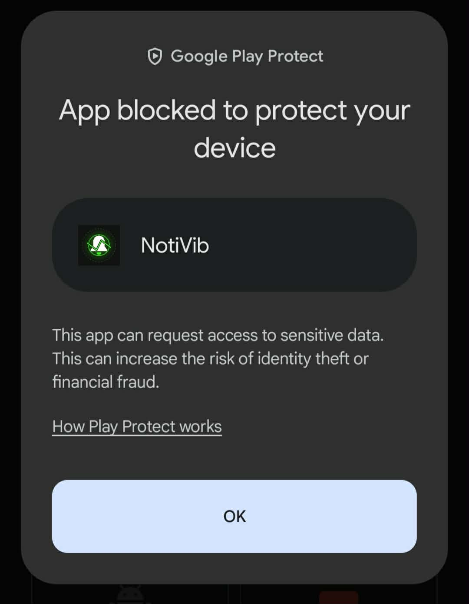
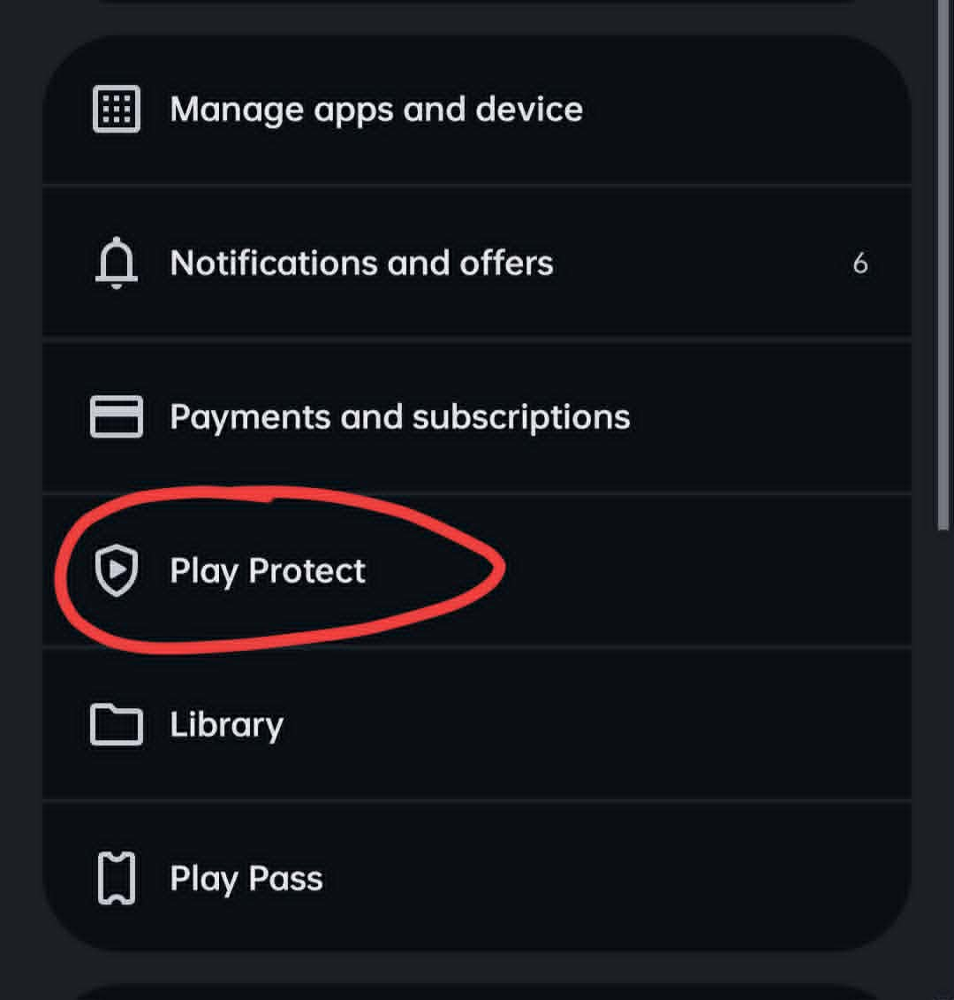
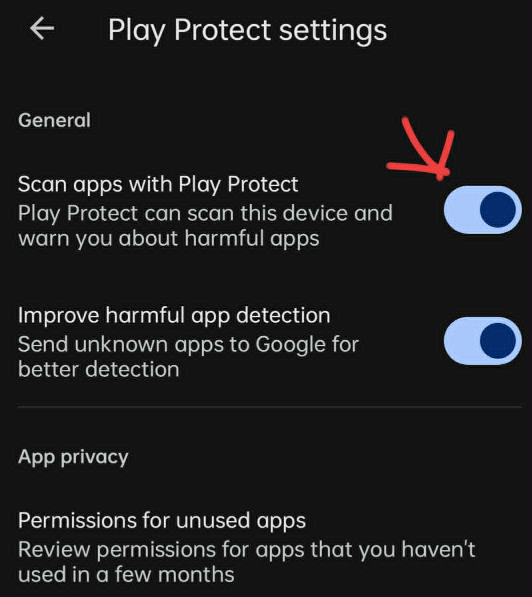
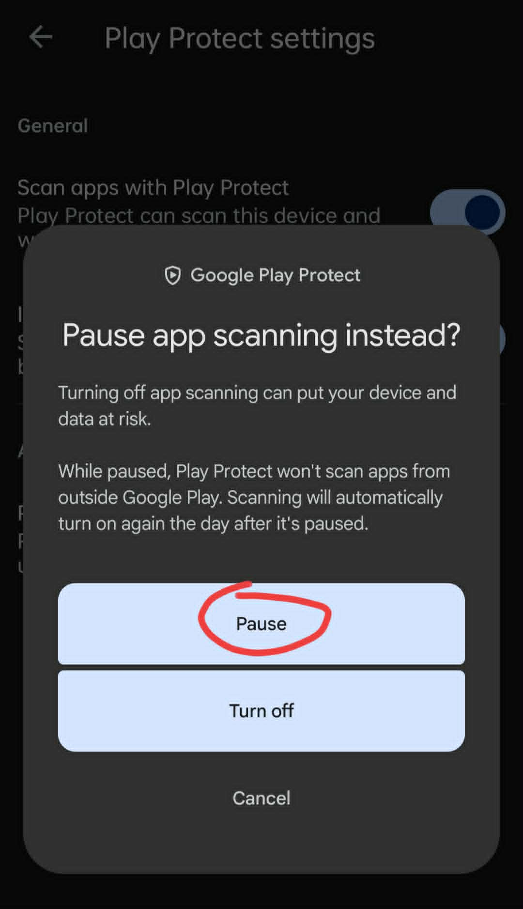
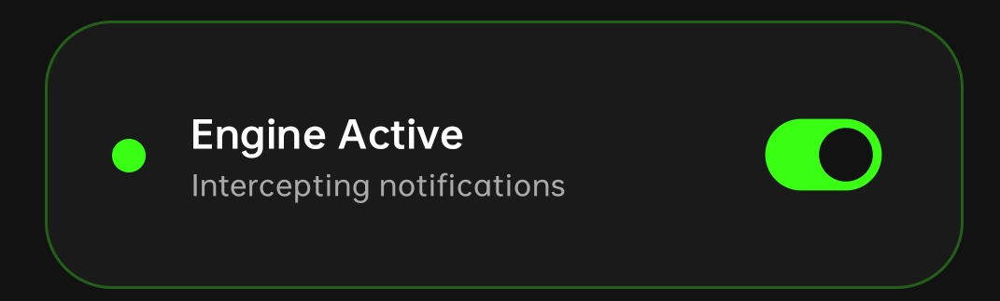

# 🔔 NotiVib (Notification Alarm Interceptor)

NotiVib is an advanced, system-level Android application designed to intercept incoming device notifications in real-time and trigger aggressive, fully-customizable alarms based on user-defined keyword and application rules.

Built with **Jetpack Compose**, **Clean Architecture**, and **Dagger Hilt**, NotiVib operates 24/7 in the background. It solves the problem of missing critical messages by overriding standard notification behavior, forcing the device to ring and vibrate continuously until manually acknowledged.

---

## 🚀 Key Features

* **Global Notification Interception**: Leverages Android's `NotificationListenerService` to passively read all incoming push notifications.
* **Granular Rule Engine**: 
  * **App Targeting**: Filter by specific installed apps. Friendly names (e.g., *Messenger*) and exact icons are instantly rendered in the UI instead of raw package names.
  * **Keyword Matching**: Provide multiple comma-separated keywords to scan the notification content (e.g., *URGENT, Boss, Emergency*).
  * **Time Windows & Day Scheduling**: Restrict rules to active hours (e.g., 08:00 to 20:00) and explicitly select active days of the week (e.g., M, W, F).
  * **Active Toggles**: Master pause/resume toggles on individual rules to temporarily disable them without deleting.
* **Aggressive Alarms**: 
  * **Full Alarm Mode**: Triggers a persistent Android 14+ Foreground Service (`ActiveAlarmService`) that blasts the device's alarm ringtone at maximum volume with continuous vibration.
  * **Vibration-Only Mode**: For silent, haptic-only alerts that still refuse to stop until acknowledged.
* **Singleton Alarm State**: Mathematically prevents overlapping audio/vibration loops if multiple chat messages arrive within the exact same millisecond.
* **Persistent Auditing & Logging**: 
  * **Interception Logs**: A persistent, expandable history of all trapped notifications, highlighting exactly which rule triggered the alarm.
  * **System Lifecycle Logs**: Tracks exactly when the Android OS creates, binds, or destroys the background interceptor process.
* **Master Kill Switch**: A dedicated UI toggle that forcefully revokes the app's internal component state, guaranteeing 0% battery drain when you want the app completely dead.
* **Crash-Proof Onboarding**: An `AppNavigation` sandbox ensures the core app engine never boots up until both `POST_NOTIFICATIONS` and `NotificationListenerService` access are explicitly granted by the user.

---

## 🏗️ Architecture & Tech Stack

NotiVib strictly follows **Clean Architecture** combined with the **MVVM (Model-View-ViewModel)** design pattern. It heavily relies on unidirectional data flow (UDF) via Kotlin `StateFlow`.

* **UI Layer**: Jetpack Compose, Material 3, dynamic infinite transition animations.
* **Dependency Injection**: Dagger Hilt (`@AndroidEntryPoint`, `@HiltViewModel`).
* **Asynchrony**: Kotlin Coroutines & Flow (`Dispatchers.IO` for heavy lifting).
* **Local Storage**: Jetpack DataStore (Preferences) paired with JSON serialization for crash-proof data persistence.
* **System APIs**: `NotificationListenerService`, `Foreground Service`, `PackageManager` (for component toggling and Intent Category Launcher mapping), `Vibrator`, `RingtoneManager`.

### 📂 Folder Structure

```text
com.example.notivib
│
├── NotiVibApp.kt                      # Main Application class (Hilt setup)
├── MainActivity.kt                    # Single Activity entry point
│
├── 📁 data                            # Data Layer (Network & Local Storage)
│   ├── 📁 local                       # DataStore schemas (RulesDataStore)
│   └── 📁 repository                  # Repository Implementations
│
├── 📁 di                              # Dependency Injection
│   └── AppModule.kt                   # Hilt Providers for Repositories & DataStores
│
├── 📁 domain                          # Domain Layer (Business Logic)
│   ├── 📁 model                       # Core entities (AlarmRule, NotificationLog)
│   ├── 📁 repository                  # Interfaces for data access
│   └── 📁 usecase                     # Modular logic blocks:
│       ├── EvaluateNotificationUseCase.kt # The "Brain" scanning strings & timestamps
│       ├── GetRulesUseCase.kt
│       ├── SaveRuleUseCase.kt
│       └── DeleteRuleUseCase.kt
│
├── 📁 framework                       # Android OS Interfaces
│   └── 📁 service
│       ├── InterceptorService.kt      # Passive NotificationListenerService
│       └── ActiveAlarmService.kt      # Foreground Service controlling audio/vibration
│
└── 📁 presentation                    # UI Layer
    ├── 📁 navigation                  
    │   └── AppNavigation.kt           # Crash-proof permission sandbox
    ├── 📁 rules_list                  
    │   ├── RulesListScreen.kt         # Main Compose Dashboard & Radar
    │   └── RulesListViewModel.kt      # StateHolder bridging UseCases to UI
    └── 📁 theme                       # Typography, Colors, Material 3 definitions
```

---

## 🧠 How the Engine Works

1. **The Listener**: `InterceptorService.kt` binds directly to the Android OS. Every time a push notification hits your phone, `onNotificationPosted` fires.
2. **The Evaluator**: The notification's package name, title, and body text are routed to `EvaluateNotificationUseCase`. It checks the current system time against your saved Time Windows, formats the installed app names, and does a case-insensitive scan for your comma-separated keywords.
3. **The Trigger**: If a rule matches, the Interceptor fires a strict Intent to start `ActiveAlarmService`.
4. **The Alarm**: `ActiveAlarmService` creates a high-priority Android Notification Channel. It promotes itself to a Foreground Service (bypassing Android Doze restrictions), loops the default system alarm `Ringtone`, and executes a continuous vibration `longArrayOf`.
5. **The Acknowledgment**: The user clicks the "STOP" action on the Foreground Notification, which calls `stopSelf()`, killing the audio and vibration loops.

---

## 🎨 UI / UX Aesthetics

NotiVib breaks away from boring utility apps. 
* **Dynamic Radar**: The main dashboard features an infinitely pulsing `InfiniteRepeatableSpec` animation representing the app's active listening state. 
* **Stateful Colors**: The interface reacts to the underlying OS state. If the Master Kill Switch is disabled, the app bleeds red warning colors to indicate it is dormant. Green cards indicate active intercepts.
* **Dialog Architecture**: Data-heavy views (System Logs, Installed App Pickers, Rule Editing) are elegantly contained within Material 3 `AlertDialog` overlays to keep the main dashboard pristine.

---

## 🔒 Permissions Required

To function, NotiVib requires highly elevated system privileges:
1. `android.permission.POST_NOTIFICATIONS`: Required on Android 13+ to display the Foreground Service alarm toggle.
2. `android.permission.VIBRATE`: Required to access the device's haptic engine.
3. `android.permission.FOREGROUND_SERVICE`: Required to keep the alarm process alive while the screen is locked.
4. `android.permission.QUERY_ALL_PACKAGES`: Required to query the `PackageManager` for a highly sanitized list of user-facing launcher apps.
5. **Notification Access**: An explicit OS-level settings toggle allowing the app to read incoming data packets from other applications.

---

## 📥 Download & Installation

You can install NotiVib directly on your Android device or build it from source.

### Option 1: Direct APK Download
Download the latest APK directly from our official Google Drive folder:
👉 **[Download NotiVib APK here](https://drive.google.com/drive/folders/1MkSZoYEB-yaJ9XSat125DIVbM10n1UHB?usp=sharing)**

### Option 2: Build from Source
1. Clone the repository.
2. Open in Android Studio Iguana (or newer).
3. Let Gradle sync and resolve Dagger Hilt dependencies (`ksp` plugin).
4. Build the APK via `./gradlew assembleDebug` or click the green **Run** arrow.
5. *Note: The app requires a physical device or an emulator with Google Play Services to simulate real incoming notifications.*

---

## 🛡️ Setup & Bypassing Google Play Protect

Because NotiVib is an aggressive system-level interceptor that you are side-loading outside of the Google Play Store, Android's Play Protect will flag it as an "Unsafe App". This is expected behavior for custom background services. 

To successfully install the app, follow these steps:

1. When the "Unsafe App Blocked" popup appears, tap **More details**.
2. Tap **Install anyway**.
3. Once installed, grant all requested system permissions (Notification Access, Overlay, etc.) when prompted by the app's onboarding screen.

*(Images demonstrating the bypass process)*





---

## ⚙️ Engine Active Toggle

The app features a master **Engine Active** switch on the main dashboard.



**What it does:**
* **Engine Active (ON)**: The `NotificationListenerService` is actively scanning every incoming notification against your rules. If a match is found, alarms will trigger.
* **Engine Suspended (OFF)**: The engine completely pauses. The app will ignore all incoming notifications, bypassing your rules entirely, acting as a global "Do Not Disturb" mode for the app without having to turn off individual rules.

---
*Developed with modern Android Engineering Standards.*
